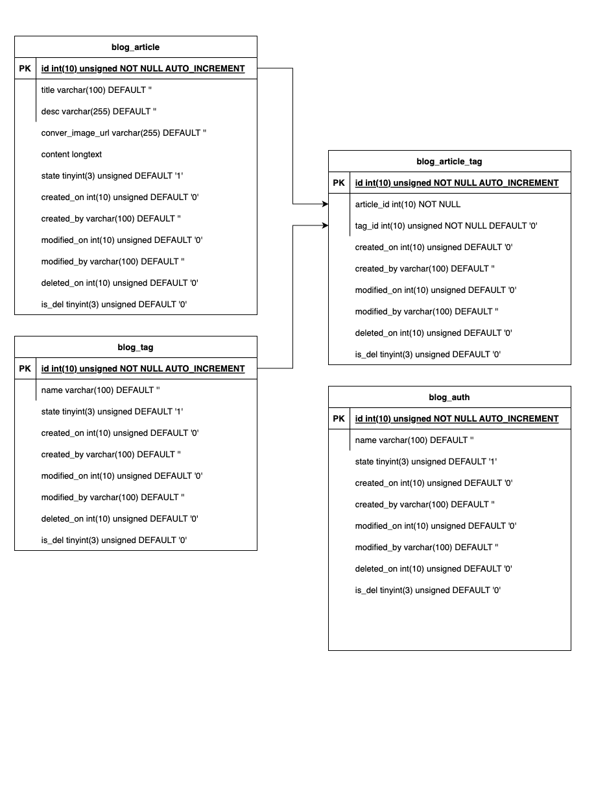

# blog-small-project
---

Blog-Backend-Simple-Porject 是使用 Golang + MySQL 建立的簡易文章及標籤的後端專案，部署於Heroku，以Restful API來進行資料的互動需要。

---
**Features**
- JWT授權
- 使用Git Action實踐自動化測試(CI)
- 整合Heroku 實踐自動化部屬(CD)

---
**Development environment**

- [Golang 1.15+](https://go.dev/)
- [MySQL](https://www.mysql.com/)

---

****DB Structure****


---

****API Reference****

[PostMan](Postman：https://www.postman.com/onineto7319/workspace/blog-small-project/request/5284931-703f8f85-6898-407d-baf1-2c1d52b4c7ef)

---

****Project Layout****
```
.
├── configs              
├── docs               
├── global               
├── migrations           
├── internal             
│   ├── router            
│   ├── middleware       
│   ├── service             
│   ├── model           
│   ├── dao           
│   ├── dto           
└── pkg                  
    ├── app        
    ├── database        
    ├── errcode              
    ├── setting      
    └── util
```
